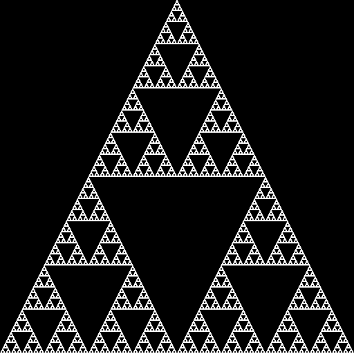

# Sierpinski Triangle Generator

This script generates a Sierpinski Triangle image using a simple iterative algorithm and saves the resulting image as `triangle.png`. The Sierpinski Triangle is a fractal and attractive fixed set with the overall shape of an equilateral triangle, subdivided recursively into smaller equilateral triangles.

## Prerequisites

Before running this script, ensure you have the following packages installed:

- numpy
- Pillow (PIL Fork)
- tqdm

You can install these packages using pip:

```bash
pip install numpy Pillow tqdm
```

## Usage

To run the script, simply execute it with Python:

```bash
python sierpinski_triangle.py
```

The script will prompt you to enter the number of iterations you want to perform. The number of iterations determines the depth of recursion and detail of the Sierpinski Triangle. Keep in mind that higher iterations will result in longer processing times and larger images.

## Output

After the script finishes running, it will save the generated Sierpinski Triangle image as `triangle.png` in the current working directory. The dimensions of the image will be printed to the console.

## Example

```
How many iterations? 8
100%|██████████████████████████| 2/2 [00:00<00:00, 64035.18it/s]
100%|██████████████████████████| 4/4 [00:00<00:00, 71392.41it/s]
100%|█████████████████████████| 8/8 [00:00<00:00, 424739.65it/s]
100%|███████████████████████| 16/16 [00:00<00:00, 762600.73it/s]
100%|███████████████████████| 32/32 [00:00<00:00, 913045.77it/s]
100%|███████████████████████| 64/64 [00:00<00:00, 571139.27it/s]
100%|█████████████████████| 128/128 [00:00<00:00, 367719.80it/s]
100%|█████████████████████| 256/256 [00:00<00:00, 138440.15it/s]
100%|███████████████████████████| 8/8 [00:00<00:00, 1530.21it/s]
Dim: 512 x 512
```

This will create a `triangle.png` file with a 64x32 Sierpinski Triangle.

## Sample Output

Below is a sample output image for a Sierpinski Triangle generated by this script:



## Notes

- The script uses a simple algorithm to generate the Sierpinski Triangle by manipulating arrays and duplicating patterns.
- The `tqdm` library is used to show a progress bar for the iterations.
- The script currently initializes the triangle with a fixed size. To change the initial size, modify the `array` variable in the `main` function.

## Contributing

If you'd like to contribute to this project, please feel free to make a pull request.

## License

This project is licensed under the MIT License - see the [LICENSE](LICENSE) file for details.